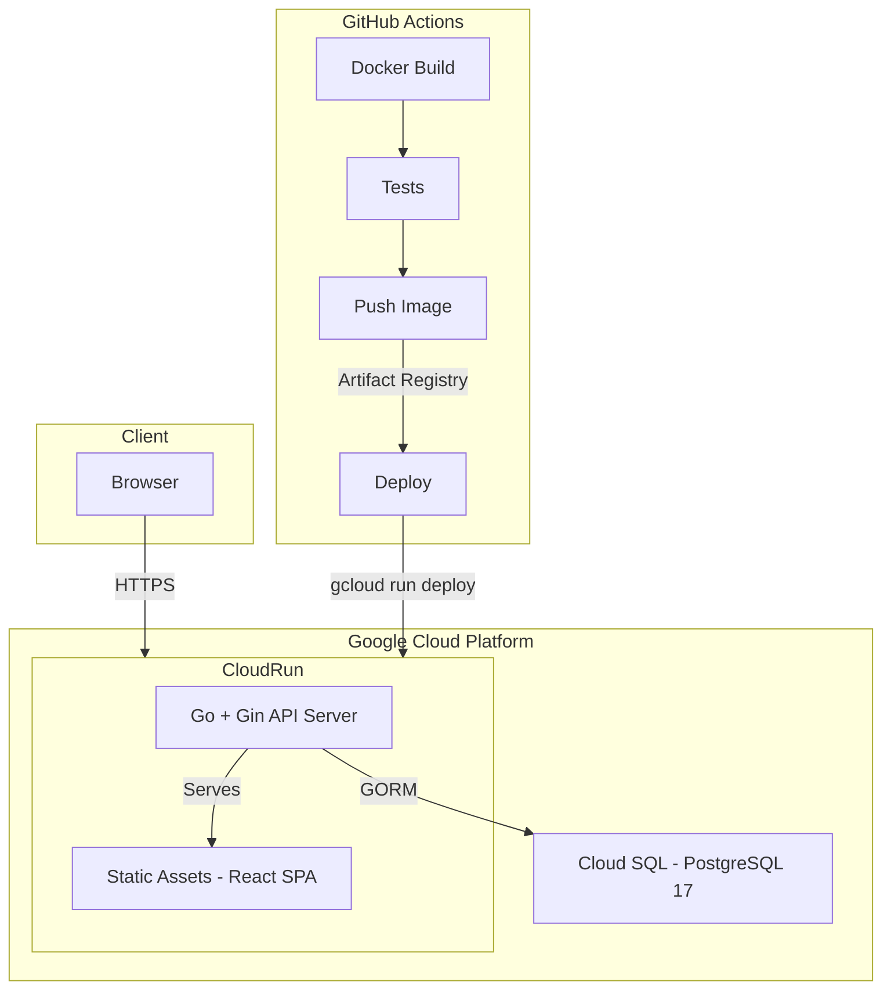
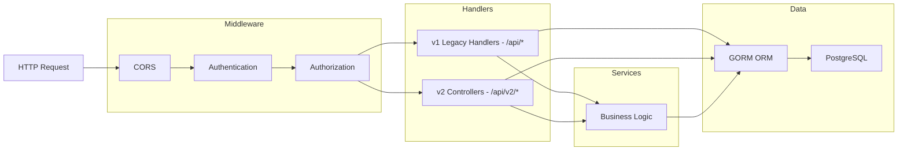
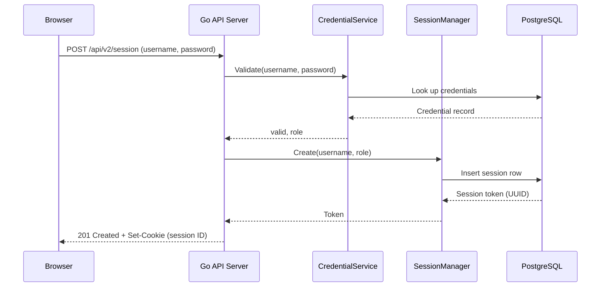
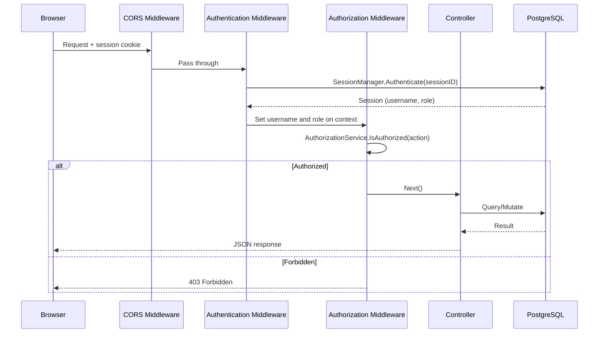
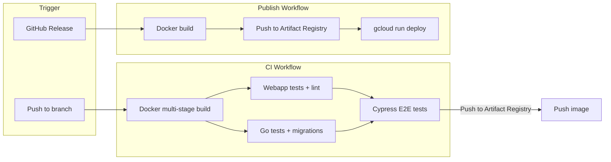

# Architecture Overview

This document describes the high-level architecture, internal backend structure, authentication flow, and deployment pipeline for the UWPSC Website.

## System Overview

The application is a three-tier system: a React single-page application (built with Vite) is compiled into static assets and served by a Go API server running on GCP Cloud Run. The server connects to a Cloud SQL PostgreSQL 17 instance for persistence.

## Backend Architecture

### Key packages

| Package | Path | Purpose |
|---------|------|---------|
| `server` | `internal/server/` | v1 legacy HTTP handlers and route setup |
| `controller` | `internal/controller/` | v2 controllers implementing `Controller` interface |
| `services` | `internal/services/` | Business logic (membership budget, event state) |
| `models` | `internal/models/` | GORM database models |
| `middleware` | `internal/middleware/` | Auth, CORS, and authorization middleware |
| `authentication` | `internal/authentication/` | Session and credential management |
| `authorization` | `internal/authorization/` | Role-based permission checking |
| `errors` | `internal/errors/` | Structured API error responses |

### v1 vs v2 API

- **v1** (`/api/*`): Handler methods on `apiServer` struct in `internal/server/`. Registered in `SetupRoutes()`.
- **v2** (`/api/v2/*`): Standalone controllers implementing the `Controller` interface with a `LoadRoutes(router *gin.RouterGroup)` method. Registered in `SetupV2Routes()`. New endpoints should use this pattern.

## Authentication and Authorization Flow

### Login

### Authenticated Request

### Frontend Auth

The React app uses an `AuthProvider` that wraps the component tree:

1. On mount, `AuthProvider` calls `GET /api/v2/session` to check for an existing session cookie.
2. If authenticated, the user session (username, role, permissions) is stored in React context.
3. `RequireAuth` wraps admin routes and redirects unauthenticated users to `/admin/login`.
4. `hasPermission(action, resource)` checks the permissions map returned by the server before rendering UI elements.

## Deployment Pipeline

### CI workflow (`ci.yml`)

Runs on every push and merge group event:

1. **Build** - Multi-stage Docker build producing the combined frontend + backend image.
2. **Webapp tests** - Lint and Jest unit tests (Node.js 22).
3. **Server tests** - Go tests against a PostgreSQL 17 container with Atlas migrations applied.
4. **E2E** - Cypress tests against the built Docker image with a fresh database.
5. **Push** - Tags and pushes the image to GCP Artifact Registry (on push events only).

### Publish workflow (`publish.yml`)

Runs on GitHub release creation:

1. **Push** - Builds and pushes a tagged image plus `latest` to Artifact Registry.
2. **Deploy** - Deploys the tagged image to Cloud Run via `gcloud run deploy`.

### Container startup

The final Docker image runs `./server start --run-migrations`, which applies pending Atlas migrations on startup before serving traffic.
