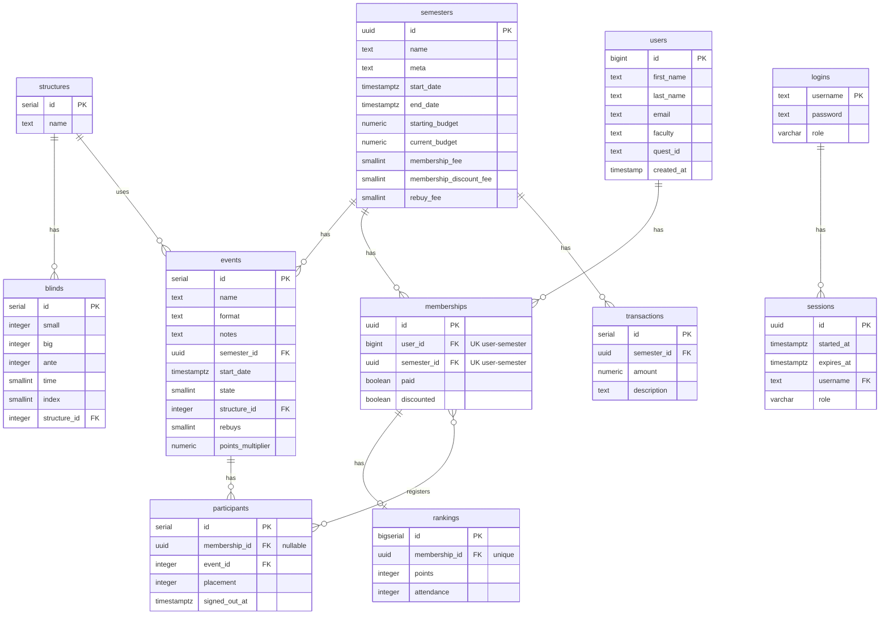

# Database Schema

PostgreSQL database managed with [Atlas](https://atlasgo.io/) migrations and [GORM](https://gorm.io/) models.

## Entity Relationship Diagram

## Tables

### semesters

Represents an academic semester/term during which the club operates. Tracks budget and fee configuration.

| Column | Type | Constraints | Description |
|--------|------|-------------|-------------|
| id | uuid | PK, default `gen_random_uuid()` | Unique identifier |
| name | text | | Semester display name (e.g. "Fall 2023") |
| meta | text | | Additional metadata |
| start_date | timestamptz | NOT NULL | Semester start date |
| end_date | timestamptz | NOT NULL | Semester end date |
| starting_budget | numeric | NOT NULL, default 0 | Initial budget for the semester |
| current_budget | numeric | NOT NULL, default 0 | Running budget balance |
| membership_fee | smallint | NOT NULL, default 0 | Standard membership fee |
| membership_discount_fee | smallint | NOT NULL, default 0 | Discounted membership fee |
| rebuy_fee | smallint | NOT NULL, default 0 | Tournament rebuy fee |

### events

A poker tournament or event held during a semester.

| Column | Type | Constraints | Description |
|--------|------|-------------|-------------|
| id | serial | PK | Auto-incrementing identifier |
| name | text | | Event name |
| format | text | | Game format (e.g. "No Limit Hold'em") |
| notes | text | | Additional notes |
| semester_id | uuid | FK -> semesters(id) | Owning semester |
| start_date | timestamptz | NOT NULL | Event date/time |
| state | smallint | default 0 | 0 = started, 1 = ended |
| structure_id | integer | NOT NULL, FK -> structures(id) CASCADE | Blind structure used |
| rebuys | smallint | NOT NULL, default 0 | Number of rebuys allowed |
| points_multiplier | numeric | NOT NULL, default 1 | Points multiplier for rankings |

### structures

Named blind structure templates that can be reused across events.

| Column | Type | Constraints | Description |
|--------|------|-------------|-------------|
| id | serial | PK | Auto-incrementing identifier |
| name | text | NOT NULL | Structure name |

### blinds

Individual blind levels within a structure, ordered by index.

| Column | Type | Constraints | Description |
|--------|------|-------------|-------------|
| id | serial | PK | Auto-incrementing identifier |
| small | integer | NOT NULL | Small blind amount |
| big | integer | NOT NULL | Big blind amount |
| ante | integer | NOT NULL | Ante amount |
| time | smallint | NOT NULL | Level duration in minutes |
| index | smallint | NOT NULL | Order within the structure |
| structure_id | integer | NOT NULL, FK -> structures(id) CASCADE | Parent structure |

### users

Club members identified by their university student ID.

| Column | Type | Constraints | Description |
|--------|------|-------------|-------------|
| id | bigint | PK (not auto-increment) | University student ID |
| first_name | text | | First name |
| last_name | text | | Last name |
| email | text | | Email address |
| faculty | text | | One of: AHS, Arts, Engineering, Environment, Math, Science |
| quest_id | text | | University Quest ID |
| created_at | timestamp | NOT NULL | Registration timestamp |

### memberships

Links a user to a semester, representing their club membership for that term.

| Column | Type | Constraints | Description |
|--------|------|-------------|-------------|
| id | uuid | PK, default `gen_random_uuid()` | Unique identifier |
| user_id | bigint | FK -> users(id) CASCADE | Member |
| semester_id | uuid | FK -> semesters(id) | Semester |
| paid | boolean | NOT NULL, default false | Whether the fee has been paid |
| discounted | boolean | NOT NULL, default false | Whether the discounted rate was applied |

**Indexes:** `UNIQUE(user_id, semester_id)`, `idx_memberships_semester_id`

### participants

Records a member's participation in a specific event. `membership_id` is nullable to preserve participation history if the membership is deleted (ON DELETE SET NULL).

| Column | Type | Constraints | Description |
|--------|------|-------------|-------------|
| id | serial | PK | Auto-incrementing identifier |
| membership_id | uuid | nullable, FK -> memberships(id) SET NULL | Participating membership |
| event_id | integer | NOT NULL, FK -> events(id) | Event participated in |
| placement | integer | | Final placement/position |
| signed_out_at | timestamptz | nullable | When the participant was eliminated |

**Indexes:** `UNIQUE(membership_id, event_id)`

### rankings

Tracks cumulative points and attendance for a membership within a semester. One-to-one with memberships.

| Column | Type | Constraints | Description |
|--------|------|-------------|-------------|
| id | bigserial | PK | Auto-incrementing identifier |
| membership_id | uuid | NOT NULL, UNIQUE, FK -> memberships(id) CASCADE | Associated membership |
| points | integer | | Cumulative points earned |
| attendance | integer | NOT NULL, default 0 | Number of events attended |

### logins

Admin/executive user credentials for the management interface.

| Column | Type | Constraints | Description |
|--------|------|-------------|-------------|
| username | text | PK | Login username |
| password | text | NOT NULL | Hashed password |
| role | varchar(20) | NOT NULL, default 'executive' | Role for authorization |

**Roles:** bot, executive, tournament_director, secretary, treasurer, vice_president, president, webmaster

### sessions

Active authentication sessions tied to a login.

| Column | Type | Constraints | Description |
|--------|------|-------------|-------------|
| id | uuid | PK, default `gen_random_uuid()` | Session token |
| started_at | timestamptz | NOT NULL | Session creation time |
| expires_at | timestamptz | NOT NULL | Session expiry time |
| username | text | NOT NULL, FK -> logins(username) CASCADE | Owning login |
| role | varchar(20) | NOT NULL, default 'executive' | Role snapshot at session creation |

### transactions

Financial transactions tracked against a semester's budget.

| Column | Type | Constraints | Description |
|--------|------|-------------|-------------|
| id | serial | PK | Auto-incrementing identifier |
| semester_id | uuid | FK -> semesters(id) | Associated semester |
| amount | numeric | NOT NULL, default 0 | Transaction amount |
| description | text | | Transaction description |

## Views

### semester_rankings_view

Computed view that calculates member rankings per semester using `RANK()` for proper tie handling. Ties receive the same position with subsequent positions skipped (e.g. 1, 1, 3).

| Column | Source | Description |
|--------|--------|-------------|
| semester_id | memberships.semester_id | Semester partition |
| membership_id | memberships.id | Membership identifier |
| user_id | users.id | User identifier |
| first_name | users.first_name | Member first name |
| last_name | users.last_name | Member last name |
| points | rankings.points | Cumulative points |
| position | RANK() | Computed rank within semester |

## Cascade Behavior

| Parent | Child | On Delete | On Update |
|--------|-------|-----------|-----------|
| semesters | events | NO ACTION | NO ACTION |
| semesters | memberships | NO ACTION | NO ACTION |
| semesters | transactions | NO ACTION | NO ACTION |
| structures | blinds | NO ACTION | NO ACTION |
| structures | events | NO ACTION | NO ACTION |
| users | memberships | CASCADE | CASCADE |
| memberships | rankings | CASCADE | CASCADE |
| memberships | participants | SET NULL | CASCADE |
| events | participants | NO ACTION | NO ACTION |
| logins | sessions | CASCADE | CASCADE |
